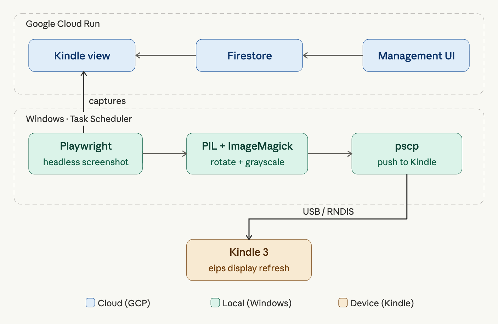
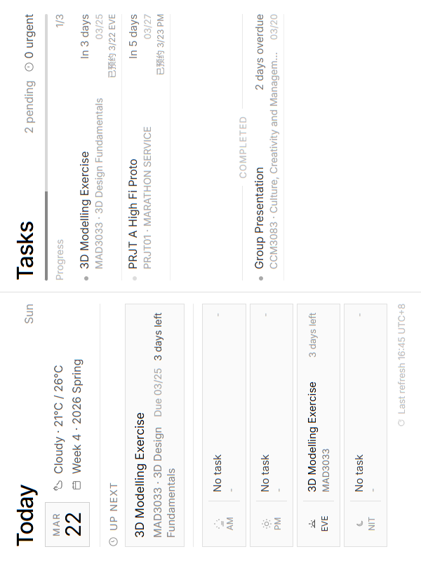
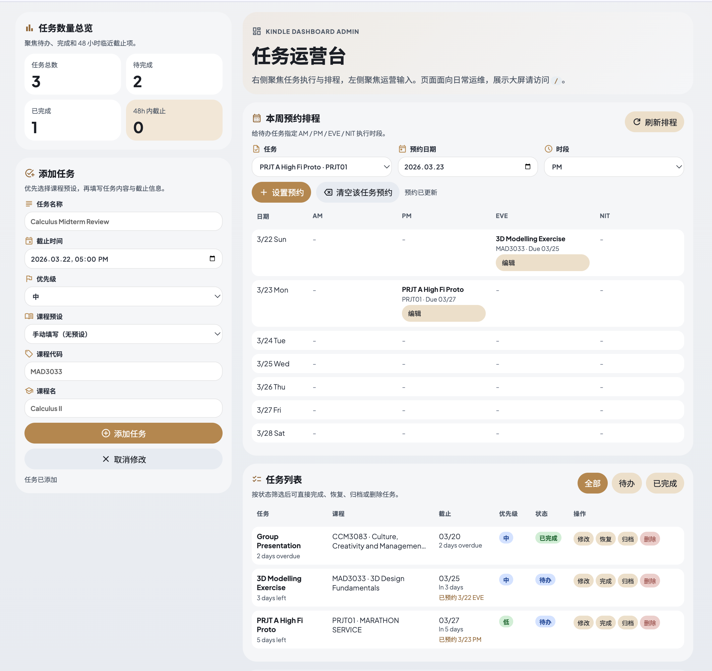

# Kindle Dashboard

> Repurposing a 2010 Kindle 3 as an always-on personal schedule dashboard — powered by a cloud-hosted web UI and a local Windows automation pipeline.


## Table of Contents

- [Overview](#overview)
- [System Architecture](#system-architecture)
- [How It Works](#how-it-works)
- [Setup Guide](#setup-guide)
  - [1. Kindle Setup](#1-kindle-setup)
  - [2. PuTTY (pscp + plink)](#2-putty-pscp--plink)
  - [3. Local Automation Setup](#3-local-automation-setup)
- [Challenges & Learnings](#challenges--learnings)
- [License & Acknowledgements](#license--acknowledgements)

---

## Overview

Before this project, I was managing my weekly schedule on a whiteboard — simple, but tedious to update and completely disconnected from my digital tools. I wanted an always-on display that could show my agenda at a glance without interrupting my workflow.

Dedicated e-ink displays are expensive, and digital photo frames are power-hungry. I happened to have an old Kindle 3 (2010) collecting dust, so the solution seemed obvious: repurpose what I already had rather than buy something new.

---

## System Architecture

The project is split into three layers: a cloud-hosted web UI, a local automation pipeline, and the Kindle itself.



**Cloud (Google Cloud Run)**

The web UI is a Node.js application hosted on Google Cloud Run. It serves two separate views from the same backend: a Kindle-facing display page optimized for 800×600 grayscale rendering, and a management interface for adding and editing tasks on desktop or mobile. Task data is persisted in Google Cloud Firestore. A QWeather API integration provides a 3-day weather summary displayed on the Kindle view.

| Live output on the Kindle display | Management Interface |
|---|---|
|  |  |

**Local Automation (Windows)**

A Python script, triggered on a schedule by Windows Task Scheduler, handles the image capture and processing pipeline. Playwright launches a headless Chromium instance, navigates to the Kindle view, and takes an 800×600 screenshot. The image is then rotated 90° counterclockwise with PIL to match the Kindle's portrait orientation, and processed by ImageMagick — resized to 600×800, converted to 8-bit grayscale, and stripped of metadata. The result is a display-ready JPEG.

**Kindle Connection (USB over RNDIS)**

The Kindle 3 connects to the Windows machine via USB, presenting itself as a virtual network adapter (RNDIS). This creates a local network interface at a fixed IP address, allowing file transfer over SCP. A `.bat` script uses `pscp` to push the processed image to the Kindle's local storage, then `plink` to execute `eips` — the Kindle's built-in e-ink display utility — to clear the screen and render the new image.

---

## How It Works

A full refresh cycle runs as follows:

1. Windows Task Scheduler triggers the capture script at a set interval.
2. Playwright launches a headless browser, navigates to the Kindle view, and takes an 800×600 screenshot in landscape orientation.
3. The image is rotated 90° counterclockwise by PIL to match the Kindle's portrait screen, then converted to 8-bit grayscale and resized to 600×800 by ImageMagick.
4. `pscp` transfers the processed JPEG to the Kindle over the USB/RNDIS virtual network interface.
5. `plink` executes `eips` on the Kindle to clear the screen and render the new image.

---

## Setup Guide

> **Note:** This guide covers the platform-specific steps that are hardest to figure out independently. Web UI deployment is intentionally not covered in detail — the application can be self-hosted on any cloud platform that supports Node.js containers (e.g. Google Cloud Run, AWS App Runner). Refer to your provider's documentation and the environment variables listed in `.env.example`.

### 1. Kindle Setup

Jailbreaking the Kindle 3 unlocks SSH access and the ability to install third-party packages. The process relies on two community tools: KUAL (Kindle Unified Application Launcher) and USBNetwork. All required packages and detailed instructions can be found on the [MobileRead forums](https://www.mobileread.com/forums/forumdisplay.php?f=150).

**Step 1 — Jailbreak the device**

Follow the instructions in the [Kindle 3 jailbreak thread](https://www.mobileread.com/forums/showthread.php?t=88004) to enable unofficial package installation.

**Step 2 — Install KUAL**

[KUAL](https://www.mobileread.com/forums/showthread.php?t=203326) (Kindle Unified Application Launcher) is required to manage and launch Kindle extensions, including USBNetwork.

> ⚠️ KUAL's built-in `developer.keystore` expired on April 17, 2025. If you encounter signing errors, install the [updated keystore](https://www.mobileread.com/forums/showpost.php?p=4506164&postcount=1295) before proceeding.

**Step 3 — Install USBNetwork**

Install the USBNetwork extension via KUAL. This enables SSH and SCP access over a USB virtual network interface (RNDIS).

**Step 4 — Configure USBNetwork on Windows**

Set up the RNDIS adapter on your Windows machine and assign a static IP to match the Kindle's default address (`192.168.15.244`).

> ⚠️ Windows 10/11 users may encounter a driver compatibility issue with the RNDIS adapter. Refer to [this thread](https://www.mobileread.com/forums/showthread.php?t=272170) for the fix.

---

### 2. PuTTY (pscp + plink)

[PuTTY](https://www.putty.org/) is a suite of SSH/SCP utilities for Windows. This project uses two of its command-line tools: **pscp** for file transfer and **plink** for remote command execution.

The GUI version of PuTTY is useful during initial setup — you can enter the Kindle's IP address and verify that the SSH connection is working before automating anything. Once confirmed, the GUI is no longer needed.

**pscp** and **plink** are the headless counterparts designed for scripted, non-interactive use. The jailbroken Kindle 3 has no root password by default, so after accepting the host key on first connection, all subsequent calls are fully silent — no prompts, no interaction.

```bash
# Transfer the processed image to the Kindle
pscp kindle_display.jpg root@192.168.15.244:/mnt/us/dashboard/

# Clear the screen and render the new image
plink -batch root@192.168.15.244 "eips -c && eips -g /mnt/us/dashboard/kindle_display.jpg"
```

> **Note:** On first run, pscp/plink will prompt you to cache the Kindle's host key. Accept it once, and the connection will be silent from that point on.

---

### 3. Local Automation Setup

#### Prerequisites

Install the following before proceeding:

- [Python 3.x](https://www.python.org/)
- [ImageMagick](https://imagemagick.org/) — ensure `magick` is accessible from your system PATH
- PuTTY (pscp + plink) — see the previous section

Then install the Python dependencies:

```bash
pip install playwright pillow
playwright install chromium
```

#### Configuration

Update the following variables in `1_website_capture_finalized.py` to match your environment:

```python
URL = "https://your-cloud-run-url/"
OUTPUT_DIR = r"C:\path\to\your\KindleDashboard\Output"
```

In `2_push_to_kindle.bat`, confirm the Kindle's IP address matches the RNDIS-assigned address:

```bat
pscp -pw "" -scp .\Output\latest.jpg root@192.168.15.244:/tmp/latest.jpg
```

#### Running Manually

To test the full pipeline end-to-end, run:

```bat
REFRESH_ALL.bat
```

This captures a screenshot, processes the image, and pushes it to the Kindle in sequence. Verify the display updates before setting up automation.

#### Scheduling with Windows Task Scheduler

1. Open **Task Scheduler** → **Create Basic Task**
2. Set the trigger to your desired interval (e.g. every 30 minutes)
3. Set the action to **Start a Program**, pointing to `REFRESH_ALL.bat`
4. Under **Conditions**, uncheck *Start the task only if the computer is on AC power* if needed
5. Save — the dashboard will now refresh automatically in the background

---

## Challenges & Learnings

**1. USBNetwork installed without KUAL — service fails to start**

USBNetwork requires KUAL as a prerequisite to start the SSH service on boot. Installing USBNetwork alone produces no error message, making the root cause non-obvious. The fix required digging through MobileRead forum threads to identify the correct installation order and dependency requirements.

**2. KUAL installed but fails to launch — expired developer keystore**

After installing KUAL, the launcher would not start. The issue turned out to be an expired `developer.keystore` file — a known problem on older Kindle firmware where the bundled keystore has a hard-coded expiration date. Replacing it with an updated version resolved the issue.

**3. Kindle not recognized as a network adapter on Windows — incorrect driver**

After connecting the Kindle via USB, Windows failed to recognize it as an RNDIS network adapter and instead enumerated it as a COM (serial) device, preventing the USB/IP networking setup from working. Installing the RNDIS driver from the MobileRead forum resolved the enumeration issue, after which the Kindle appeared correctly as a virtual network adapter.

---

## License & Acknowledgements

This project uses [PuTTY](https://www.putty.org/) (pscp and plink), which is copyright © Simon Tatham and contributors, and is distributed under the MIT License. The full license text is available at [https://www.putty.org/licence.html](https://www.putty.org/licence.html).

The majority of the codebase was written and guided by **ChatGPT Codex**, whose assistance made this project feasible in a reasonable timeframe. All of the technical references — jailbreaking, USBNetwork, KUAL, RNDIS driver fixes, and `eips` usage — were sourced from the wonderful community at **[MobileRead Forums](https://www.mobileread.com/)**, without which none of this would have been possible. **Claude** provided additional assistance in polishing the project and this documentation.
